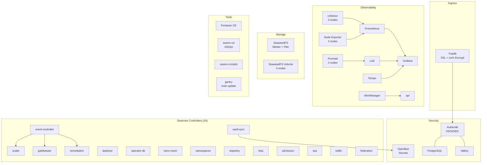
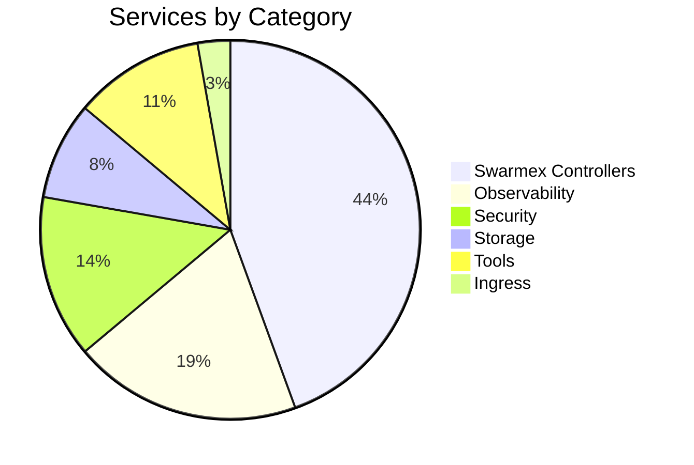
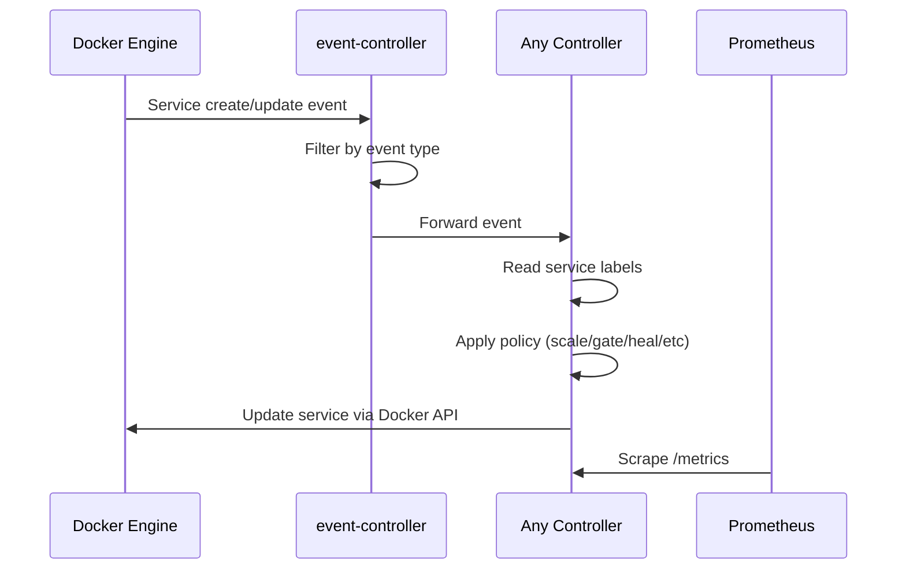

# Swarmex

Enterprise-grade orchestration for Docker Swarm — closing every feature gap with Kubernetes via lightweight Go controllers configured through Docker labels.

**35 services running on a 3-node cluster. 17 controllers verified end-to-end. Cross-cloud federation tested (AWS ↔ GCP). Reproducible install from scratch — 35/35 on first deploy. 100% open source.**

## Why Swarmex

Kubernetes solves orchestration but demands significant resources and expertise. Docker Swarm is simple and efficient but lacks enterprise features like autoscaling, admission control, RBAC, and multi-cluster federation.

Swarmex bridges this gap. Instead of replacing Swarm's architecture, it extends it with sidecar controllers that watch Docker events and act on service labels — the same way you already configure Traefik or Portainer.

```yaml
deploy:
  labels:
    swarmex.scaler.enabled: "true"
    swarmex.scaler.min: "2"
    swarmex.scaler.max: "10"
    swarmex.namespace: "production"
    swarmex.vpa.enabled: "true"
    swarmex.federation.replicate: "true"
    swarmex.federation.clusters: "gcp,azure"
```

No CRDs. No operators. No YAML complexity. Just labels.

## Architecture

```
                         ┌─────────────────────────────────────────────────┐
                         │              DOCKER SWARM CLUSTER               │
                         │                                                 │
  Internet ──► Traefik ──┤  ┌──────────┐  ┌──────────┐  ┌──────────┐     │
               (SSL)     │  │ Manager  │  │ Worker 1 │  │ Worker 2 │     │
                         │  │          │  │          │  │          │     │
                         │  │ Swarmex  │  │ Your     │  │ Your     │     │
                         │  │ Control  │  │ Apps     │  │ Apps     │     │
                         │  │ Plane    │  │          │  │          │     │
                         │  └────┬─────┘  └──────────┘  └──────────┘     │
                         │       │                                        │
                         │       ▼                                        │
                         │  Docker Socket (/var/run/docker.sock)          │
                         │       │                                        │
                         │  ┌────┴──────────────────────────────────┐     │
                         │  │         17 Swarmex Controllers        │     │
                         │  │                                       │     │
                         │  │  event-controller ──► scaler          │     │
                         │  │                  ──► gatekeeper       │     │
                         │  │                  ──► remediation      │     │
                         │  │                  ──► deployer         │     │
                         │  │                  ──► vault-sync       │     │
                         │  │                  ──► operator-db      │     │
                         │  │                  ──► nano-mesh        │     │
                         │  │                  ──► namespaces       │     │
                         │  │                  ──► netpolicy        │     │
                         │  │                  ──► rbac             │     │
                         │  │                  ──► admission        │     │
                         │  │                  ──► vpa              │     │
                         │  │                  ──► traffic          │     │
                         │  │                  ──► federation ──────┼──► Remote Clusters
                         │  │                  ──► api              │     │
                         │  └───────────────────────────────────────┘     │
                         │                                                 │
                         │  ┌─────────────────────────────────────────┐   │
                         │  │           OSS Platform Stack            │   │
                         │  │                                         │   │
                         │  │  Prometheus ─► Grafana ─► AlertManager  │   │
                         │  │  Loki ◄── Promtail    Tempo             │   │
                         │  │  Authentik   OpenBao   SeaweedFS        │   │
                         │  │  Portainer   swarm-cd  swarm-cronjob    │   │
                         │  └─────────────────────────────────────────┘   │
                         └─────────────────────────────────────────────────┘
```

## Controllers

Swarmex has 16 controllers organized in three tiers. Each is a single Go binary (~8MB), reads configuration from Docker service labels, and exposes `/health` and `/metrics` endpoints.

### Core — Workload Management

| Controller | Purpose | Verified With |
|:---|:---|:---|
| `event-controller` | Listens to Docker event stream, dispatches to all controllers | Real-time create/update/health events captured |
| `scaler` | Horizontal autoscaling based on CPU/RAM via Prometheus | test-app scaled 2→5→2 replicas under load |
| `gatekeeper` | Readiness probes — enables Traefik routing only when healthy | Log: "service READY, enabling Traefik" |
| `remediation` | Self-healing escalation: restart → force-update → drain node | Drained manager node on persistent failures (safety: never drains last manager) |
| `deployer` | Blue/green deployments via parallel service + Traefik weights | Green service created with httpd:alpine |
| `vault-sync` | Syncs secrets from OpenBao to containers, supports hot-reload | 2 secrets synced from OpenBao KV v2 |
| `operator-db` | Database health monitoring and automatic failover | PostgreSQL failover triggered on container kill, recovered to 1/1 |
| `nano-mesh` | Service mesh peer registration via EasyTier (WireGuard) | Peers registered for mesh-enabled services |

### Governance — Security and Isolation

| Controller | Purpose | Verified With |
|:---|:---|:---|
| `namespaces` | Creates isolated overlay networks per namespace label | ns-frontend, ns-backend, ns-production networks created |
| `netpolicy` | Cross-namespace access control via network attachment | svc-be granted access to ns-frontend network |
| `rbac` | Docker socket proxy with role-based access, JWT support | JWT token → akadmin → admin role → granted; anonymous → denied |
| `admission` | Validates and mutates services on creation | Denied service without memory limit; denied without team label; auto-added `managed-by: swarmex` label; works with `docker stack deploy` |

### Advanced — Enterprise Features

| Controller | Purpose | Verified With |
|:---|:---|:---|
| `vpa` | Vertical autoscaling — adjusts CPU/RAM limits based on usage | Adjusted 512M→32M RAM, 1CPU→0.1CPU for idle nginx |
| `traffic` | Circuit breaker, retries, rate limiting via Traefik middlewares | retry + rate-limit policies applied to test-app |
| `federation` | Multi-cluster service replication across clouds | **AWS→GCP cross-cloud replication verified** (see below) |
| `api` | Custom resource API server with persistent storage (bbolt) | CRUD verified; resources survive container restart |
| `cluster-scaler` | Auto-provision/deprovision cloud nodes (AWS/GCP/Azure/DO) | ✅ AWS scale-up verified: 3→5 nodes on CPU spike |

## Cross-Cloud Federation

Federation was tested with a temporary 3-node GCP cluster (e2-medium, us-central1-a):

```
  AWS us-east-1                          GCP us-central1-a
  ┌──────────────┐    Docker TCP API     ┌──────────────┐
  │ Swarm Cluster│◄──────────────────────│ Swarm Cluster│
  │ 3x t3.large  │    federation ctrl    │ 3x e2-medium │
  │              │    replicates svc     │              │
  │ fed-test 2/2 │ ──────────────────►   │ fed-test 2/2 │
  └──────────────┘                       └──────────────┘
```

1. Federation controller connected to GCP Docker API
2. Created `fed-test` (nginx:alpine, 2 replicas) with `swarmex.federation.clusters=gcp`
3. Service appeared on GCP: `fed-test 2/2` running on 2 GCP nodes
4. Updated image to `httpd:alpine` on AWS → GCP synced automatically
5. GCP cluster deleted after verification

## Platform Stack

All tools are 100% open source. When dual-licensed (CE/EE), only the community edition is used.

Traefik runs on the manager with Swarm routing mesh — traffic on ports 80/443 reaches Traefik from any node IP. If the manager fails, point DNS to another node. Cloudflare DNS challenge provides wildcard SSL certificates for multiple domains without exposing port 80.



## Service Inventory (35 services)



| Stack | Services | Replicas |
|:---|:---|:---|
| Ingress | Traefik | 1 |
| Observability | Prometheus, Grafana, Loki, Tempo, AlertManager, cAdvisor (×3), Node Exporter (×3) | 7 services, 13 containers |
| Security | Authentik (server + worker), PostgreSQL, Valkey, OpenBao | 5 |
| Storage | SeaweedFS master, volume (×3), filer | 3 services, 5 containers |
| Tools | Portainer CE, swarm-cd, swarm-cronjob, gantry | 4 |
| Swarmex | 16 controllers (event-controller through api) | 16 |

## Resource Comparison

| | Kubernetes (3-node) | Swarmex (3-node) |
|:---|:---|:---|
| Control plane RAM | 1.5–2 GB | ~100 MB (embedded in Docker) |
| Control plane components | 5 (etcd, apiserver, scheduler, controller-manager, coredns) | 0 |
| Total platform RAM | 4–6 GB (control plane + monitoring) | 1.8 GB (35 services + monitoring) |
| 16 controllers total | — | ~100 MB (6 MB each) |
| Idle cluster CPU | 15–25% | ~19% |
| Setup time | 30–60 min | ~5 min |
| Config per service | 3–5 YAML files | 1 Compose file + labels |
| Managed service cost | $70–150/month (EKS/GKE/AKS) | $0 |
| Total controller binaries | — | 16 × ~8 MB = 128 MB |

Measured on 3× t3.large (2 vCPU, 8 GB RAM each) with 35 services and 41 containers running:

| Node | Containers | CPU | RAM |
|:---|:---|:---|:---|
| Manager | 28 | 9.7% | 440 MiB |
| Worker 1 | 7 | 6.1% | 792 MiB |
| Worker 2 | 6 | 3.2% | 550 MiB |
| **Total** | **41** | **~19%** | **~1.8 GiB / 24 GiB** |

## When to Use Kubernetes Instead

Swarmex closes most feature gaps with Kubernetes, but K8s has real advantages in specific scenarios. Be honest about the trade-offs:

| Area | Kubernetes Advantage | Swarmex Approach |
|:---|:---|:---|
| **Ecosystem** | Thousands of Helm charts, operators, CRDs ready to use | 16 custom controllers — covers core needs but no third-party ecosystem |
| **Advanced scheduling** | Affinity/anti-affinity, taints/tolerations, topology spread, pod disruption budgets | Basic placement constraints only |
| **Stateful workloads** | StatefulSets with stable identity, dynamic PV provisioning | No native equivalent — use named volumes + placement constraints |
| **Multi-tenancy** | Namespaces with ResourceQuotas, LimitRanges, kernel-level NetworkPolicies | Simulated via controllers — not kernel-level enforcement |
| **Service mesh** | Istio, Linkerd, Cilium (eBPF) — production-proven at scale | nano-mesh (EasyTier/WireGuard) — simpler but less mature |
| **Enterprise adoption** | Managed services (EKS, GKE, AKS), certifications, commercial support, large talent pool | Docker Swarm is in maintenance mode — smaller community |
| **Canary deployments** | Native canary with exact traffic percentages, rollback by metrics | Blue/green only — no weighted canary |
| **API extensibility** | CRDs with validation webhooks, custom controllers, full API machinery | Labels-based — simpler but less powerful |

**Choose Kubernetes when:** you need a large ecosystem of third-party operators, advanced scheduling for complex stateful workloads, kernel-level network isolation, or your organization already has K8s expertise and managed service budgets.

**Choose Swarmex when:** you want enterprise features without the complexity and resource overhead, your team knows Docker Compose, you run on constrained infrastructure, or you need a platform that deploys in 5 minutes with 1.8 GB of RAM.

## Test Environment

All features were tested on a live AWS cluster, not in simulation:

| | Detail |
|:---|:---|
| Cloud | AWS us-east-1 |
| Nodes | 3× t3.large (2 vCPU, 8 GB RAM, Ubuntu 24.04) |
| Docker | 29.4.0 with Swarm mode |
| DNS | `*.swarmex.apulab.info` via Cloudflare |
| SSL | Let's Encrypt wildcard (Cloudflare DNS challenge) |
| Registry | Self-hosted GitLab at `registry.labtau.com` |
| CI/CD | GitLab CI with kaniko (17 pipelines) |
| Services | 35 running simultaneously on 3 nodes |
| Uptime | Cluster survived remediation drain, controller restarts, and stress tests |

Cross-cloud federation was tested with a temporary 3-node GCP cluster (e2-medium, us-central1-a) — created, tested, and deleted in the same session.

Cluster autoscaling was tested by generating CPU load (12 stress containers) — the cluster-scaler provisioned 2 additional EC2 instances (t3.medium), which joined the Swarm automatically. After removing the load, both instances were drained and terminated, returning to the original 3 nodes.

## Quick Start

### Automated Install (Recommended)

```bash
git clone git@scovil.labtau.com:ccvass/swarmex/swarmex-coordinator.git
cd swarmex-coordinator
bash scripts/install.sh
```

The installer asks for your manager IP, domain, credentials, and optional cloud provider for autoscaling. It handles registry login, secrets, networks, configs, and deploys all 6 stacks in the correct order (platform first, controllers last). Takes ~5 minutes for 35/35 services.

### Manual Install

```bash
# Clone
git clone git@scovil.labtau.com:ccvass/swarmex/swarmex-coordinator.git
cd swarmex-coordinator

# Initialize Swarm (if not already)
docker swarm init

# Login to registry on ALL nodes
echo "<token>" | docker login registry.labtau.com -u "gitlab+deploy-token-409" --password-stdin

# Create Docker secrets
echo -n "<db-password>" | docker secret create authentik_db_pw -
echo -n "<secret-key>" | docker secret create authentik_secret -
echo -n "<grafana-pw>" | docker secret create grafana_admin_pw -
echo -n "<cf-token>" | docker secret create cloudflare_api_token -
echo -n "<bao-token>" | docker secret create openbao_root_token -

# Create overlay networks and configs
bash scripts/pre-deploy.sh

# Deploy stacks IN ORDER (swarmex MUST be last)
docker stack deploy -c stacks/ingress.yml --with-registry-auth ingress
docker stack deploy -c stacks/observability.yml --with-registry-auth observability
docker stack deploy -c stacks/security.yml --with-registry-auth security
docker stack deploy -c stacks/storage.yml --with-registry-auth storage
docker stack deploy -c stacks/tools.yml --with-registry-auth tools

# Wait 60s for platform services to stabilize before deploying controllers
sleep 60
docker stack deploy -c stacks/swarmex.yml --with-registry-auth swarmex
```

> **Important:** The swarmex stack contains the admission controller which enforces `team` label and `memory` limit on all services. If deployed before platform stacks are running, admission will remove them. Always deploy swarmex last.

## Project Structure

```
swarmex-coordinator/
├── README.md                  # This file
├── ROADMAP.md                 # Implementation phases
├── STANDARDS.md               # Go 1.26, patterns, conventions
├── stacks/                    # Docker Compose stacks
│   ├── ingress.yml            #   Traefik + Let's Encrypt
│   ├── observability.yml      #   Prometheus, Grafana, Loki, Tempo, Promtail
│   ├── security.yml           #   Authentik, OpenBao, PostgreSQL, Valkey
│   ├── storage.yml            #   SeaweedFS (master, volume, filer)
│   ├── tools.yml              #   Portainer, swarm-cd, swarm-cronjob, gantry
│   └── swarmex.yml            #   All 16 controllers
├── configs/                   # Service configurations
│   ├── prometheus/            #   Scrape configs + alert rules
│   ├── grafana/               #   Datasource provisioning
│   ├── loki/                  #   Storage + rate limits
│   ├── tempo/                 #   OTLP receivers
│   ├── alertmanager/          #   Webhook receiver
│   ├── promtail/              #   Docker SD log collection
│   ├── openbao/               #   KV v2 config
│   ├── seaweedfs/             #   Master entrypoint
│   ├── swarmcd/               #   GitOps repos
│   └── admission/             #   Validation + mutation rules
├── docker/authentik/          # Patched Authentik image
├── scripts/
│   ├── pre-deploy.sh          #   Create networks + configs
│   ├── backup.sh              #   Automated backup (daily cron)
│   ├── clone-all.sh           #   Clone all 31 repos
│   ├── aws-stop.sh            #   Stop AWS instances
│   └── aws-start.sh           #   Start AWS instances
└── docs/
    ├── K8S-VS-SWARMEX.md      # Feature comparison (35+ features)
    ├── FORK-STATUS.md          # Fork analysis + upstream PRs
    └── USER-GUIDE.md           # How to deploy your app on Swarmex
```

## Repositories (31)

All hosted in the `ccvass/swarmex` GitLab group with CI/CD pipelines building container images via kaniko.

- **1** coordinator (this repo)
- **16** custom controllers (Go, ~8MB each)
- **1** patched fork (Authentik — Attr dataclass fix)
- **4** active forks as-is (swarm-cronjob, gantry, swarm-cd, EasyTier)
- **4** active forks with improvements (SeaweedFS Swarm, SeaweedFS volume plugin, Portainer CE, Swarmpit)
- **5** archived forks (superseded)

## Controller Lifecycle



## Upstream Contributions

| PR | Repository | Description |
|:---|:---|:---|
| [#21557](https://github.com/goauthentik/authentik/pull/21557) | goauthentik/authentik | Fix Attr dataclass path navigation for Docker Swarm env vars |
| [#3](https://github.com/cycneuramus/seaweedfs-docker-swarm/pull/3) | cycneuramus/seaweedfs-docker-swarm | Swarm overlay IP resolution in entrypoint scripts |

## Documentation

| Document | Description |
|:---|:---|
| [USER-GUIDE.md](docs/USER-GUIDE.md) | How to deploy your app on Swarmex — all labels explained |
| [K8S-VS-SWARMEX.md](docs/K8S-VS-SWARMEX.md) | Feature-by-feature comparison with Kubernetes (35+ features) |
| [FORK-STATUS.md](docs/FORK-STATUS.md) | Fork analysis, what was changed, upstream PR status |
| [ROADMAP.md](ROADMAP.md) | Implementation phases and OSS resource mapping |
| [STANDARDS.md](STANDARDS.md) | Go 1.26, project patterns, deploy conventions |
| [configs/LABELS.md](configs/LABELS.md) | Complete `swarmex.*` label reference |

## License

Apache-2.0

## Maintainer

Alfonso de la Guarda — [CCVASS](https://ccvass.com)
